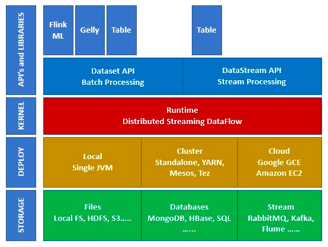
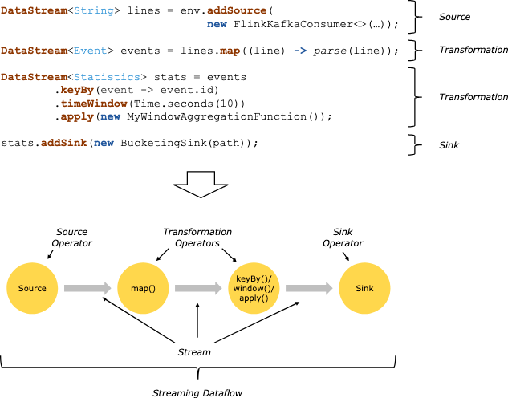

## Intro
this project is for flink sql demo.

## Ecosystem on Apache Flink

## [Storage](https://nightlies.apache.org/flink/flink-docs-master/docs/connectors/table/overview/) 
Apache Flink has multiple options from where it can Read/Write data. Below is a basic storage list −
<ol>
<li>HDFS (Hadoop Distributed File System)</li>
<li>HLocal File System</li>
<li>HS3</li>
<li>HRDBMS (MySQL, Oracle, MS SQL etc.)</li>
<li>HMongoDB</li>
<li>HHBase</li>
<li>HApache Kafka</li>
<li>HApache Flume</li>
</ol>

## Generally Flink job component

## Platform environment
make sure installed the applications below before running this project  
<b>1. [kafka.](https://kafka.apache.org/downloads)  </b>
<b>2. [flink.](https://www.apache.org/dyn/closer.lua/flink/flink-1.17.0/flink-1.17.0-bin-scala_2.12.tgz)</b> If submitting job on flink locally, make sure you cloud open the 
flink manage website on http://localhost:8081/  
<b>3. if run python job on flink please install flink in python intepretor by ``python -m pip install apache-flink==1.13.6`` </b>

## Kafka topic operation

### 1. launch zookeeper locally

   <code>sudo bin/zookeeper-server-start.sh -daemon config/zookeeper.properties</code>
### 2. launch kafka locally  
``bin/kafka-server-start.sh config/server.properties``
### 3. create a kafka topic
``bin/kafka-topics.sh --bootstrap-server localhost:9092 --partitions 2 --create --topic template001``
### 4. produce data to kafka topic
``bin/kafka-console-producer.sh --tstrap-server localhost:9092 --topic source_topic --producer.config config/producer.properties``
### 5. consume data from kafka topic
``bin/kafka-console-consumer.sh --bootstrap-server localhost:9092 --from-beginning --topic sink_topic``

